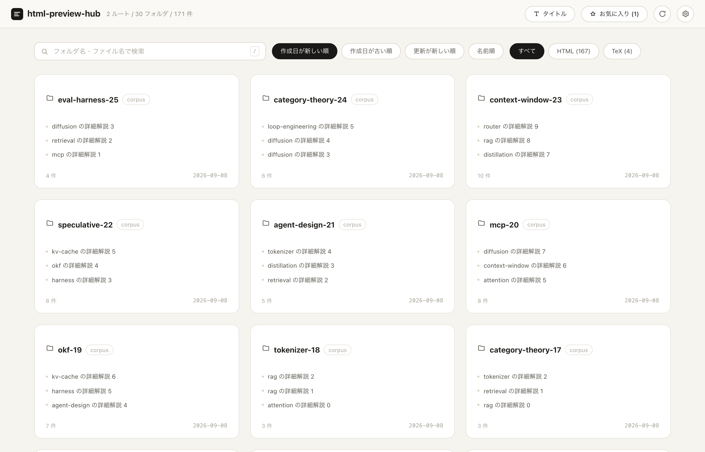
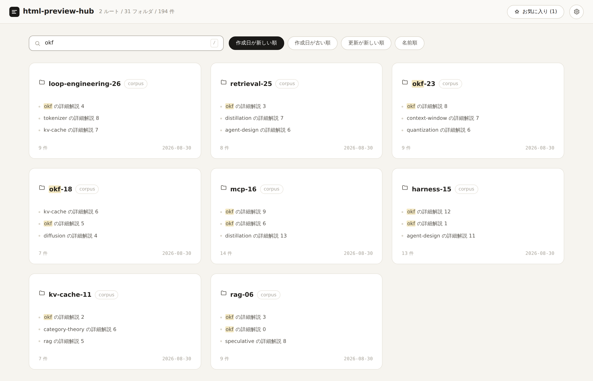
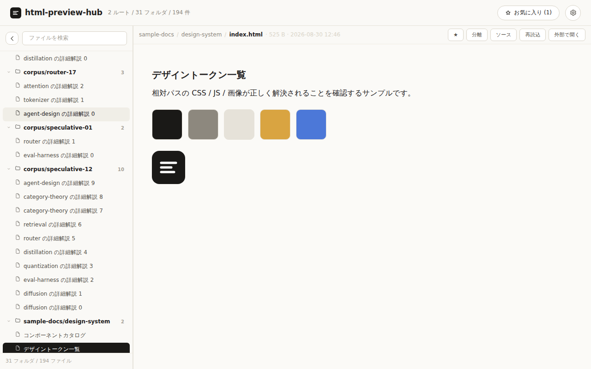
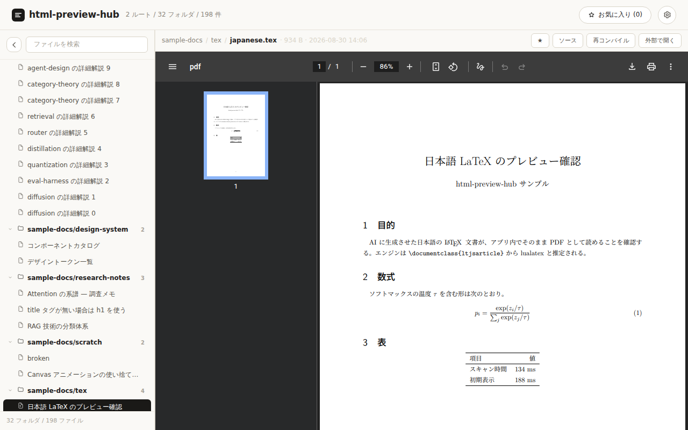
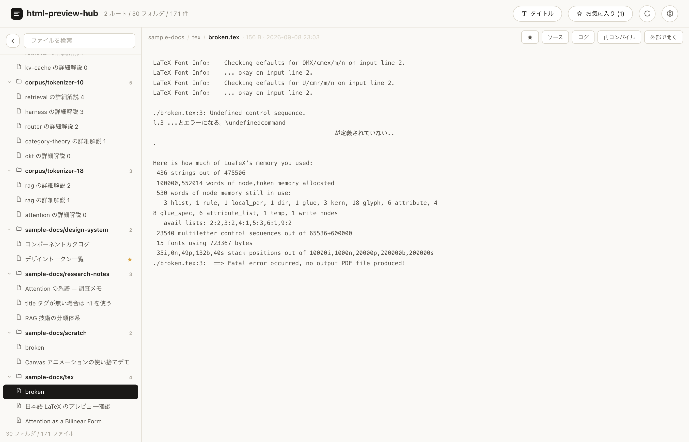

# html-preview-hub

ローカルのあちこちに散らばった **HTML / LaTeX** ファイル（AI が生成した使い捨てのものから、
残しておきたい資料まで）を **1 つの画面で横断・検索・即プレビュー**するためのローカル Web アプリ。

「フォルダを掘って、ファイルを探して、ブラウザで開く（LaTeX ならさらに手でコンパイルする）」という
ポチポチ作業をなくすことが目的です。



| 検索（インクリメンタル） | HTML プレビュー |
| --- | --- |
|  |  |

| LaTeX プレビュー（自動コンパイル） | コンパイルエラーのログ |
| --- | --- |
|  |  |

## 特徴

- **フォルダカードのホーム画面** — フォルダ単位でカード表示。件名（HTML の `<title>` / LaTeX の `\title`）、件数、日付が一覧で分かる。
- **インクリメンタルサーチ** — フォルダ名・パス・ファイル名・タイトルを横断。ヒット箇所をハイライトし、一致したファイルをカード内で先頭に出す。
- **インラインプレビュー** — 外部ブラウザを開かず、アプリ内の iframe に表示。サンドボックスで隔離するため、プレビュー対象の CSS / JS はアプリ本体に干渉できない。
- **LaTeX の自動コンパイル** — `.tex` を選ぶとサーバー側で PDF にして同じ画面に表示する。エンジンは自動判定し、結果はキャッシュするので 2 回目以降は即表示。失敗したらエラー箇所を含むログをその場で開ける。
- **相対パス・ルート絶対パスの解決** — プレビュー対象と同じ階層の画像 / CSS / JS はそのまま読める。`/assets/app.css` のようなルート絶対パス参照も解決する。
- **即応する切り替え** — 一度開いたファイルは iframe プールに残るため、行き来しても再読み込みが起きない。サイドバーは仮想スクロールで数千件でも軽い。
- **お気に入り / 非表示フォルダ / 種類フィルタ** — 残したいものに星を付け、ノイズになるフォルダはカード右クリックで隠し、HTML と TeX はチップで切り替える。
- **表示名の切り替え** — 一覧に出す名前を、文書のタイトル（既定）とファイル名でヘッダーのボタンから切り替えられる。設定はブラウザに保存される。
- **自動追従** — バックグラウンドで再スキャンし、変更があればロングポーリングで画面に反映（手動リロード不要）。
- **設定は UI からもファイルからも** — 対象フォルダの追加・削除、対象拡張子、除外フォルダ、階層の深さなどを画面上で編集し、JSON 設定ファイルに保存する。

## 動作要件

- Python 3.10 以上（3.11 / 3.13 で確認）
- 依存パッケージは **FastAPI と uvicorn の 2 つだけ**（フロントエンドはビルド不要のバニラ JS + CSS）
- LaTeX の PDF プレビューを使う場合のみ、TeX エンジンを別途インストール（任意）

```bash
# 最小構成（英数字の文書）
sudo apt install texlive-latex-base latexmk        # Debian / Ubuntu
brew install --cask mactex-no-gui                  # macOS

# 日本語文書（ltjsarticle / jsarticle など）も扱う場合
sudo apt install texlive-lang-japanese texlive-luatex texlive-latex-extra
```

エンジンが無い環境でも一覧・検索・HTML プレビューはそのまま動き、`.tex` は「ソースを表示」で中身を確認できます。

## 起動

### 一番簡単な方法

```bash
./start.sh ~/Documents/html     # 仮想環境作成 → 依存インストール → 起動 → ブラウザが開く
```

引数を省略すると `config.json`（無ければ同梱の `sample-docs/`）を対象に起動します。

### 手動で行う場合

```bash
python3 -m venv .venv && source .venv/bin/activate
pip install -r requirements.txt

# 対象フォルダを指定して起動（--save で設定ファイルに保存）
python -m hph ~/Documents/html --save

# 設定ファイルの内容で起動
python -m hph

# ポートやホストを変える / ブラウザを自動で開かない
python -m hph ~/Documents/html --port 9000 --host 127.0.0.1 --no-browser
```

起動すると `http://127.0.0.1:8765/` が開きます。対象フォルダは起動後に画面右上の ⚙ からも追加できます。
コマンドライン引数と設定ファイルの詳細は [docs/configuration.md](docs/configuration.md) を参照してください。

## ドキュメント

| ドキュメント | 内容 |
| --- | --- |
| [docs/usage.md](docs/usage.md) | 画面の使い方とキーボードショートカット |
| [docs/configuration.md](docs/configuration.md) | 設定ファイル・コマンドライン引数・状態ファイル |
| [docs/architecture.md](docs/architecture.md) | 設計書（ディレクトリ構成・処理フロー・設計判断・セキュリティ設計） |
| [docs/api.md](docs/api.md) | HTTP API 仕様 |

## テスト

```bash
pip install -r requirements-dev.txt
python -m pytest            # 73 tests

# ブラウザ操作の E2E（任意 / Playwright が必要）
python -m hph ./sample-docs --port 8899 --no-browser &
npm install playwright && npx playwright install chromium
node tests/e2e/app.e2e.js   # LaTeX エンジンが無い環境では PDF の検証だけ自動でスキップ
```
