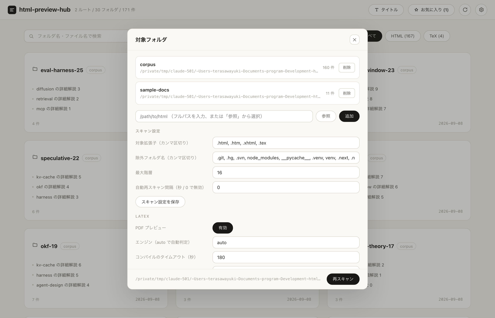

# 使い方ガイド

html-preview-hub の画面構成と操作方法をまとめます。設定ファイルのキー一覧は
[configuration.md](./configuration.md)、内部設計は [architecture.md](./architecture.md)、
API 仕様は [api.md](./api.md) を参照してください。

## 画面の構成

画面は 3 つです。

- **ホーム** — 対象フォルダをカードで一覧表示する起動時の画面。
- **プレビュー** — 左にファイルツリーのサイドバー、右にプレビュー領域を並べた画面。カード
  またはツリーのファイルを開くと遷移します。
- **設定** — 右上の ⚙ ボタンまたは `,` キーで開くモーダル。対象フォルダの管理とスキャン / LaTeX 設定を行います。

サーバーはバックグラウンドで再スキャンし、変更があればロングポーリングで画面へ自動反映します。手動リロードは不要です。

## ホーム画面

フォルダ単位でカードが並びます。各カードには次の情報が出ます。

- フォルダ名（複数ルートを登録している場合、または階層が深い場合はルート名も表示）
- ファイル最大 3 件（タイトルは HTML の `<title>` / LaTeX の `\title` から取得。取れない場合はファイル名）
- ファイル件数と作成日

ツールバーには以下の操作があります。

- **並び替えチップ** — 作成日が新しい順 / 古い順、更新が新しい順、名前順。
- **種類チップ** — `HTML` / `TeX`。両方の種類が混在しているときだけ表示されます（片方しかない場合は自動的に「すべて」のままになります）。
- **お気に入りチップ**（右上） — お気に入り登録したファイルを含むカードだけに絞り込みます。
- **非表示フォルダチップ** — ノイズになるフォルダをカード右クリックで非表示にでき、このチップで非表示分だけを表示・再表示できます（対象が 0 件の間は表示されません）。

### 表示名の切り替え

ヘッダーの「お気に入り」の左隣にあるボタンで、一覧（ホームのカードとプレビューのサイドバー）に出す
ファイルの表示名を切り替えられます。

| 表示 | 例 |
| --- | --- |
| タイトル（既定） | コンポーネントカタログ |
| ファイル名 | components.html |

ボタンには現在のモードが出ます。押すたびに切り替わり、選択はブラウザ（localStorage）に保存されるので
次回起動時も維持されます。検索はどちらのモードでもタイトル・ファイル名の両方を対象にします。

## 検索

ホーム上部の検索欄にインクリメンタルサーチがあります。フォルダ名・パス・ファイル名・タイトルを横断して検索し、
一致箇所はハイライト表示、一致したファイルはカード内で先頭に並び替わります。

プレビュー画面のサイドバーにも同様の検索欄があり、こちらはツリー内のフォルダ / ファイルのみが対象です。

## プレビュー

ファイルを開くとサイドバーのツリーとプレビュー領域が表示されます。ツリーはフォルダの折りたたみに対応し、
選択中のファイルへ自動でスクロールします。プレビュー領域上部には現在のパンくず（フォルダ階層 / ファイル名 /
サイズ / 更新日時）が出ます。

- **HTML** は `iframe` にそのまま描画します。既定は「分離」モード（`allow-same-origin` なしのサンドボックス）で、
  プレビュー対象の CSS / JS はアプリ本体に一切干渉できません。`localStorage` などを使うページを確認したい場合は
  ツールバーの「分離 / 互換」ボタンで「互換」モードに切り替えられますが、その分サンドボックスの分離レベルは下がります
  （TeX / PDF 表示では意味を持たないためボタン自体が非表示になります）。
- **ソース表示**（ツールバーの「ソース」ボタン、または `u`）は生のテキストをそのまま表示します。
- **LaTeX** は `.tex` を選ぶとサーバー側で自動コンパイルし、結果の PDF をブラウザ内蔵ビューアで表示します。
  エンジン（pdflatex / xelatex / lualatex / uplatex / tectonic）は自動判定され、結果は内容ハッシュでキャッシュされるため
  2 回目以降は即表示です。

  

  コンパイルに失敗した場合はエラーカードが出て、「ログを表示」ボタン（ツールバーの「ログ」ボタン、または `l`）から
  エラー箇所を含むコンパイルログをその場で確認できます。「ログ」ボタンはログが存在するときだけ表示されます。

  

- **再読み込み**（ツールバーの「再読込」ボタン、または `r`）は HTML なら iframe の再読み込み、LaTeX なら
  強制再コンパイル（キャッシュを無視して再実行）になります。ボタンのラベルも種別に応じて切り替わります。
- 一度開いたファイルは iframe プールに残るため、他のファイルを経由して戻ってきても再読み込みは発生しません
  （プールの上限を超えた古いものから破棄されます）。
- 「外部で開く」ボタンから既定のブラウザでも開けます。

## 設定画面

右上の ⚙ ボタン、または `,` キーで開きます。

- **対象フォルダ** — フルパスを入力するか「参照」からディレクトリを選んで追加します。登録済みのフォルダは
  名前・パス・件数が一覧表示され、「削除」で対象から外せます（フォルダが見つからない場合は一覧上でも分かります）。
- **スキャン設定** — 対象拡張子、除外フォルダ名、最大階層、自動再スキャン間隔をこの画面から編集できます。
- **LaTeX** — PDF プレビューの有効 / 無効、使用エンジン、タイムアウト、コンパイル回数を編集でき、
  検出済みエンジン（pdflatex / xelatex / lualatex / tectonic など）もあわせて表示されます。
- 上記以外の設定キー（`ignore_globs` や `tex_cache_limit` など）は設定ファイルを直接編集します。
  キーの一覧は [configuration.md](./configuration.md) を参照してください。
- モーダル下部には現在読み込んでいる設定ファイルのパスと、「再スキャン」ボタン（手動での再スキャン）があります。

## キーボードショートカット

| キー | 動作 |
| --- | --- |
| `/` または `Ctrl` / `⌘` + `K` | 検索にフォーカス |
| `↑` / `↓` | ファイルを移動（プレビュー画面） |
| `Enter` | 開く |
| `Esc` | 一覧へ戻る / 検索解除 |
| `r` | プレビューを再読み込み（LaTeX は強制再コンパイル） |
| `u` | ソース表示の切り替え |
| `l` | コンパイルログの切り替え（LaTeX） |
| `f` | お気に入り切り替え |
| `[` | サイドバーの表示切り替え |
| `,` | 設定を開く |
| カード右クリック | フォルダの非表示切り替え |

※ プレビュー（iframe）内をクリックするとキー入力はプレビュー側へ渡ります。ショートカットを使うときは
サイドバーやツールバーを一度クリックしてください。

## 関連ドキュメント

- [../README.md](../README.md)
- [./architecture.md](./architecture.md)
- [./api.md](./api.md)
- [./configuration.md](./configuration.md)
